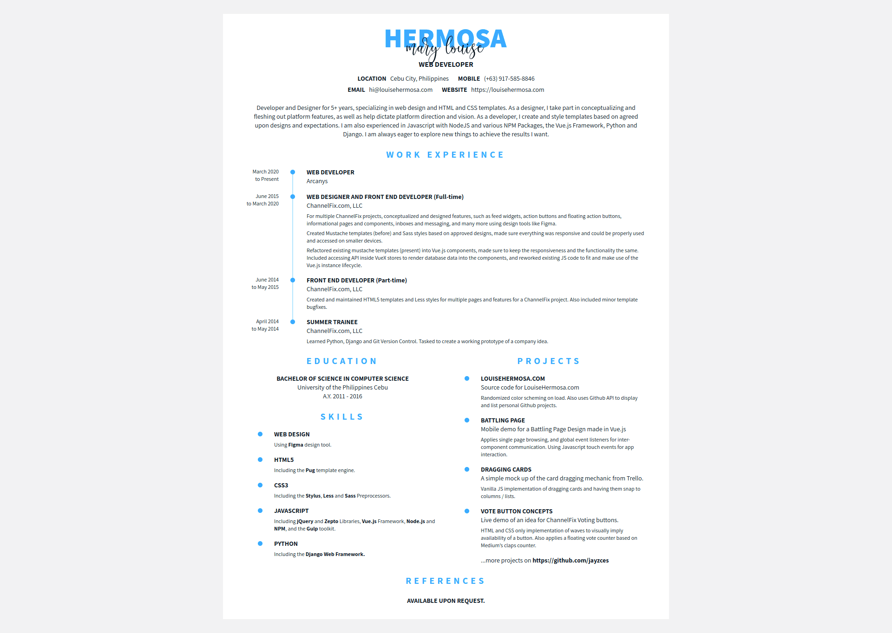

[](https://app.netlify.com/sites/distracted-kilby-30f83b/deploys)

Personal Resume
===============
Source Code for LouiseHermosa.com resume page.



## For Development
The following must be installed globally
- `npm i -g bower` - [Bower](https://bower.io/) to rewrite dependencies in `bower.json`
- `npm i -g gulp-cli` - [Gulp CLI](https://gulpjs.com/) to run Gulp 4

```
# install dependencies
npm install
npm run bower

# includes a watcher
gulp develop

# run local server
npm run serve dist
```

## For Production
```
npm install && npm run prod
```

Then serve `dist/` folder.